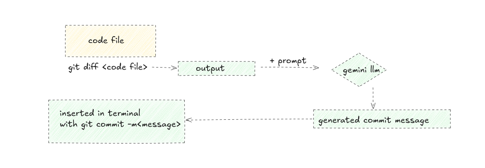
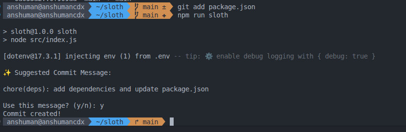

# slothcommit
sloth is a opensource AI powered git commit assistant , it helps you write conventional git commit message based on your file change

## why i built this 

i hate thinking about commit messages manually , so what i used to (its huge pain in tha ass btw) use to copy my code to gpt and tell it to write commit message based on the changes made between old and new file and then manually paste it into terminal , so i decided to build sloth which does it all with one command.

## tech stack

- Nodejs 

## how it works

## sample 

## connect with me
- for suggestions write me at anshumanprof01@gmail.com.

- explore my tech blog : [blog](anshumancdx.xyz/blog)
- or subscribe to my newsletter [newsletter](https://newsletter.anshumancdx.xyz/)